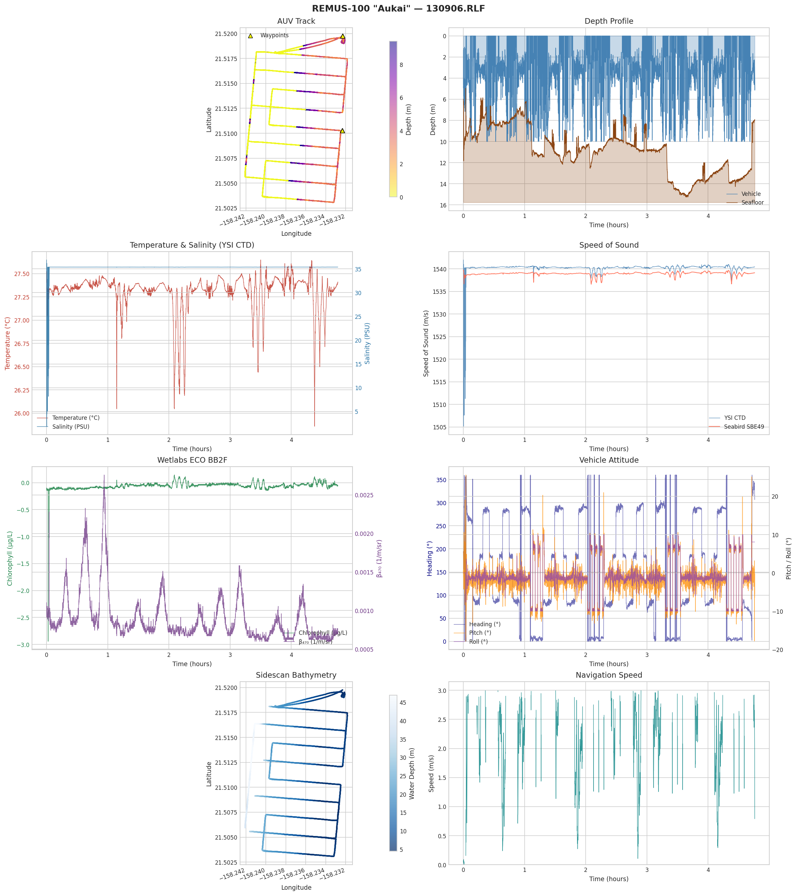
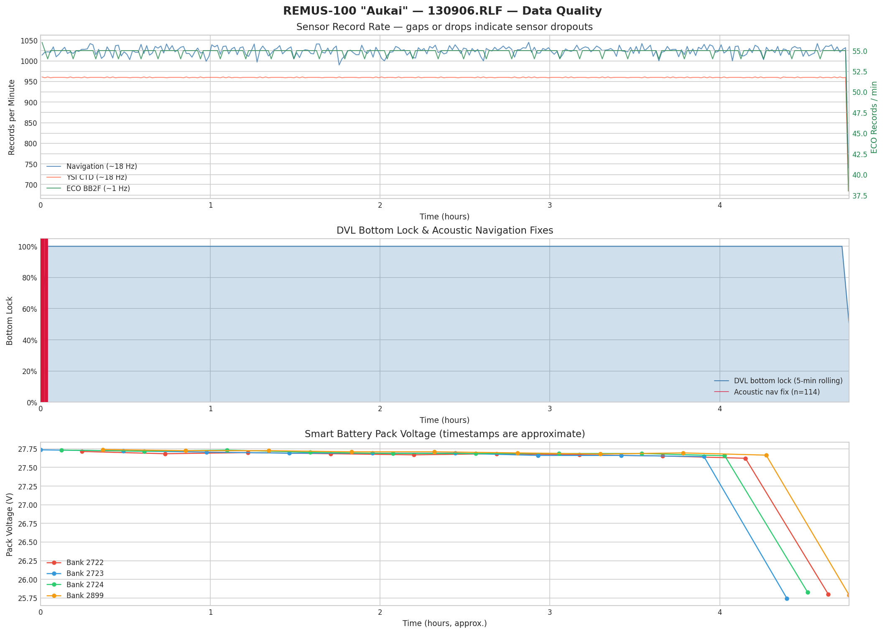

# remus-rlf-reader

[](LICENSE)
[](https://creativecommons.org/licenses/by/4.0/)

Python parser for **REMUS-100 AUV Run Log Files** (`.RLF`) and companion ADCP data files (`.ADC`, `.GPS`, `.rmf`).

Format derived from analysis of the [Makua Beach dataset](https://doi.org/10.6075/J09P3042) (UCSD Library), collected by the REMUS-100 "Aukai" (SN 256, Hydroid Inc.) off O'ahu, Hawaiʻi, September 6–8, 2013.

> **⚠ Disclaimer:** The binary format specification and all field decoders were derived empirically by pattern analysis — no official Hydroid/Kongsberg documentation was used. Field offsets, scaling factors, and physical interpretations may be incorrect. **Verify decoded values against independent measurements before using them in analysis.**




---

## Files

| File | Description |
|------|-------------|
| `remus_rlf.py` | RLF binary parser — decodes all known record types into NumPy arrays |
| `remus_adcp.py` | ADCP companion file parser — RDI PD0 `.ADC`, `.GPS` position log, `.rmf` mission file |
| `REMUS_RLF_FORMAT_SPEC.txt` | Empirically derived binary format specification |

---

## RLF Format

Each `.RLF` file is a stream of binary records with an 8-byte header:

```
Offset  Size  Type       Description
0       2     uint8[2]   Magic bytes: 0xEB 0x90
2       2     uint16 LE  Checksum
4       2     uint16 LE  Record type
6       2     uint16 LE  Payload length (bytes)
8       N     bytes      Payload
```

### Decoded record types

**High-rate sensor data**

| Type    | Dec  | Name                | Rate       |
|---------|------|---------------------|------------|
| 0x044e  | 1102 | Navigation          | ~18 Hz     |
| 0x041d  | 1053 | YSI CTD             | ~18 Hz     |
| 0x040a  | 1034 | Seabird CTD (SBE49) | ~0.3 Hz    |
| 0x03e8  | 1000 | ADCP/DVL (1200 kHz) | ~0.35 Hz   |
| 0x03f7  | 1015 | Sidescan (900 kHz)  | ~1.3 Hz    |
| 0x043e  | 1086 | Wetlabs ECO BB2F    | ~1 Hz      |
| 0x03f9  | 1017 | GPS / Acoustic Nav  | varies     |
| 0x041a  | 1050 | Nav/Acoustic        | ~0.5 Hz    |
| 0x041f  | 1055 | Acoustic Nav Fix    | ~1/4 min   |

**Mission and configuration**

| Type    | Dec  | Name                  | Description |
|---------|------|-----------------------|-------------|
| 0x03f4  | 1012 | Vehicle Name          | AUV callsign (e.g. "Aukai") |
| 0x040d  | 1037 | Vehicle Info          | Serial number, owner, firmware revisions |
| 0x0416  | 1046 | Manufacturer Info     | Manufacturer name and address |
| 0x03ee  | 1006 | Mission Modes         | Index→name mapping of all mission mode states |
| 0x03f0  | 1008 | Mission Legs          | Waypoint sequence with leg type and coordinates |
| 0x0427  | 1063 | Waypoints             | Named lat/lon waypoints with flags |
| 0x03fc  | 1020 | Sensor Names          | List of installed sensor names |
| 0x0407  | 1031 | Sensor Types          | Sensor type code→name mapping |
| 0x040c  | 1036 | Sensor Display Config | Display name, min/max range, format string per sensor |
| 0x041c  | 1052 | Data Channels         | Channel index, name, and logging rate |
| 0x043d  | 1085 | ECO Calibration       | Scale and offset coefficients per ECO channel |

**Vehicle health**

| Type    | Dec  | Name               | Description |
|---------|------|--------------------|-------------|
| 0x0412  | 1042 | Battery Status     | LiION pack voltage, cell voltage, chemistry, serial, mfg date |
| 0x0413  | 1043 | Battery Cell Data  | Per-cell voltage counts for all 4 battery banks |

**Event and diagnostic logs**

| Type    | Dec  | Name               | Description |
|---------|------|--------------------|-------------|
| 0x03e9  | 1001 | Diagnostic Log     | Vehicle software warnings and status messages |
| 0x0424  | 1060 | Acoustic Modem Log | Inbound/outbound acoustic modem messages |

### Unknown record types

The following record types were observed but could not be decoded:

| Type    | Dec  | Count/day | Bytes | Notes |
|---------|------|-----------|-------|-------|
| 0x03f1  | 1009 | ~454      | 53    | Dense binary; structure unclear |
| 0x040e  | 1038 | ~267      | 48    | f32@8 ≈ 30°C (possibly housing temperature); remaining fields unknown |
| 0x0402  | 1026 | ~864      | 13    | First 4 bytes constant; remainder unidentified |
| 0x0415  | 1045 | ~198      | 48    | Round-robin counter 1–5; float arrays in 0–360 range (possibly fin angles) |
| 0x040b  | 1035 | ~71       | 60    | Mostly zeros with sparse structured bytes |
| 0x0408  | 1032 | ~37       | 6     | 6-byte records with minimal variation |
| 0x0446  | 1094 | ~10       | 4     | Constant `01 00 00 00` — simple flag or mode marker |
| 0x03ef  | 1007 | ~9        | 0     | Empty payload — event marker or heartbeat |

---

## Installation

Requires Python 3.8+ and NumPy. Matplotlib is optional (for `--plot`).

```bash
pip install numpy matplotlib
```

---

## Usage

### Parse an RLF file

```python
from remus_rlf import parse_rlf, print_summary

parsed = parse_rlf('130906/RLF/130906.RLF')
print_summary(parsed)

nav = parsed['Navigation']
print(nav['lat'], nav['lon'], nav['depth'])
```

### Command-line summary + plot

```bash
python remus_rlf.py 130906/RLF/130906.RLF
python remus_rlf.py 130906/RLF/130906.RLF --plot
```

### Parse ADCP directory

```python
from remus_adcp import parse_adcp_directory

result = parse_adcp_directory('130906/ADCP/')
adc = result['adc']   # n_ensembles × n_cells velocity arrays
gps = result['gps']   # GPS position fixes
```

```bash
python remus_adcp.py 130906/ADCP/ --plot
```

---

## Example Output

### CLI record summary

```
Parsing: 130906/RLF/130906.RLF
Size: 34.9 MB

Record Type                       Hex      Count  Payload
----------------------------------------------------------
  Navigation                   0x044e     292749     46 B
  YSI CTD                      0x041d     274243     40 B
  Sidescan (900 kHz)           0x03f7      19857     55 B
  ADCP/DVL (1200 kHz)          0x03e8      17427    155 B
  Wetlabs ECO BB2F             0x043e      15681     57 B
  Seabird CTD (SBE49)          0x040a       4286     32 B
  GPS/Acoustic Nav             0x03f9       3313     59 B
  Acoustic Modem Log           0x0424       2401     36 B
  Nav/Acoustic                 0x041a       2144     57 B
  Diagnostic Log               0x03e9        422     93 B
  Data Channels                0x041c        260     24 B
  Mission Modes                0x03ee        200     21 B
  Vehicle Info                 0x040d        198     31 B
  Sensor Types                 0x0407        150     23 B
  Acoustic Nav Fix             0x041f        114    126 B
  Sensor Names                 0x03fc         90     13 B
  ECO Calibration              0x043d         80     46 B
  Battery Cell Data            0x0413         40     52 B
  Battery Status               0x0412         40    139 B
  Mission Legs                 0x03f0         60     48 B
  Waypoints                    0x0427         50     31 B
  Vehicle Name                 0x03f4         10     35 B
  Manufacturer Info            0x0416         10    108 B
  Sensor Display Config        0x040c         10     28 B

--- Navigation ---
  lat     min=  21.503  max=  21.520  mean=  21.511
  lon     min=-158.242  max=-158.232  mean=-158.237
  depth   min=   0.000  max=  10.000  mean=   2.130
  t_hrs   min=   0.000  max=   4.762  mean=   2.382
```

### Python API examples

```python
>>> parsed['Vehicle Name']
{'name': 'Aukai'}

>>> parsed['Vehicle Info']
{'Vehicle Serial Number': 'SN 256',
 'Vehicle Owner and ID': 'UH Aukai',
 'Vehicle rev': '(Hydroid Vehicle 256) Mar 21 2012; 10:39:16;',
 ...}

>>> parsed['Manufacturer Info']['info']
'Manufactured by Hydroid, Inc. 6 Benjamin Nye Circle, Pocasset, Ma. 02559 ...'

>>> parsed['Mission Modes']
{0: 'Manual', 1: 'Bench test', 2: 'Acoustic Test', 3: 'Hysterisis test',
 4: 'Fin wiggle test', 5: 'Abort', 6: 'Wait run', 7: 'Dead Reckon',
 8: 'DR rows', 9: 'Set position', 10: 'Wait depth', 11: 'Surface',
 12: 'Wait prop', 13: 'Compass cal', 14: 'Navigate', 15: 'Navigate rows',
 16: 'Wait magnet', 17: 'Loiter', 18: 'Get gps fix', 19: 'Reacquire'}

>>> parsed['Sensor Names']
['RDI ADCP', 'Imagenex852', 'YSI CTD', 'Seabird', 'MS Sidescan',
 'Modem', 'NMEA183 GPS', 'Wetlabs ECO', 'Smart Batt.']

>>> parsed['Waypoints'][:2]
[{'lat': 21.5198, 'lon': -158.2323, 'flags': 2, 'name': 'Compass Cal.'},
 {'lat': 21.5103, 'lon': -158.2323, 'flags': 0, 'name': 'Turn at 2.0 M'}]

>>> parsed['ECO Calibration'][:3]
[{'channel': 'Ref470',       'units': 'Counts',     'calibrated': False, 'scale': 1.0,    'offset':  0.0},
 {'channel': 'Beta470',      'units': 'B/m/sterad',  'calibrated': True,  'scale': 2.4e-5, 'offset': 50.0},
 {'channel': 'Chlorophyll A','units': 'ug/liter',    'calibrated': True,  'scale': 0.016,  'offset': 75.0}]

>>> parsed['Acoustic Nav Fix'][:2]
[{'datetime': '2013-09-06 21:17:50', 'lat': 21.5195, 'lon': -158.2321,
  'heading': 190.7, 'range_m': 173.2, 'speed': 0.412},
 {'datetime': '2013-09-06 21:17:51', 'lat': 21.5195, 'lon': -158.2321,
  'heading': 193.1, 'range_m': 150.9, 'speed': 0.669}]

>>> parsed['Battery Status'][:2]
[{'batt_id': 2723, 'chemistry': 'LiION', 'serial': '102455',
  'mfg_date': 'Dec  2 2009', 'capacity_mAh': 5500,
  'cell_mv': 3071, 'pack_mv': 27736},
 {'batt_id': 2724, 'chemistry': 'LiION', 'serial': '102455',
  'mfg_date': 'Dec  2 2009', 'capacity_mAh': 5500,
  'cell_mv': 3076, 'pack_mv': 27733}]

>>> parsed['Diagnostic Log'][:2]
[{'source_file': 'DIAGNOSE.CPP',
  'message': 'Warning: Verify transponder range test disabled in mission file, line 69'},
 {'source_file': 'SCAN_VEH.CPP',
  'message': 'Warning, objective 4 is not in altimeter mode'}]

# Acoustic modem log — direction '>' = modem→vehicle log, '<' = vehicle→modem command
# Message categories observed across the dataset:
>>> ml = parsed['Acoustic Modem Log']

# Modem firmware revision broadcast (most common — continuous heartbeat)
>>> next((m for m in ml['message'] if m.startswith('Rev:')), None)
'Rev: AUV13 (0.90.0.39)'

# Startup self-query: modem address, detection threshold, frequency band
>>> [m for m in ml['message'] if m.startswith('Query')]
['Query Self Address (SRC)', 'Query Detection threshold (PTH)', 'Query Modem freq band (BND)', ...]
>>> [m for m in ml['message'] if m.startswith('Response')]
['Response:SRC is 8', 'Response:PTH is 50', 'Response:BND is 3', ...]

# Data transmission cycle (surface comms)
>>> sorted(set(m for m in ml['message'] if any(k in m for k in ['Cycle','Tx','Data ready'])))
['Cycle Init Ack (8->0)', 'Cycle init (talk)', 'Data ready for transmission', 'Tx begin', 'Tx end']

# Acoustic ranging pings — one every ~4 minutes, timestamped
>>> [m for m in ml['message'] if m.startswith('Ranger')][:3]
['Ranger data (automatic 21:20:04.7)',
 'Ranger data (automatic 21:24:04.8)',
 'Ranger data (automatic 21:28:04.9)']

# Receive quality metric (only on successful receives)
>>> sorted(set(m for m in ml['message'] if m.startswith('Data quality')))
['Data quality: (2) 177', 'Data quality: (2) 180', 'Data quality: (2) 190',
 'Data quality: (2) 191', 'Data quality: (2) 195', 'Data quality: (2) 198']

# Errors
>>> sorted(set(m for m in ml['message'] if 'Error' in m or 'BAD' in m))
['Error 13: $ not found', 'Error 6: Undocumented error', 'Msg:BAD_CRC']
```

---

## Dataset

The raw `.RLF` and `.ADC` files are not included in this repository.
Download from the UC San Diego Library Digital Collections:

> **Amador, A. (2020). *REMUS-100 AUV data, Makua Beach, O'ahu, 2013*.**
> UC San Diego Library Digital Collections.
> https://library.ucsd.edu/dc/object/bb9937198n
> doi:[10.6075/J09P3042](https://doi.org/10.6075/J09P3042)
>
> Licensed under [CC BY 4.0](https://creativecommons.org/licenses/by/4.0/).

Expected directory layout after download:

```
130906/
  RLF/130906.RLF
  ADCP/130906.ADC  130906.GPS  130906.txt
130907/
  ...
130908/
  ...
```

---

## References

- Amador, A., Arzeno, I. B., Giddings, S. N., Merrifield, M. A., & Pawlak, G. (2020). Cross‐shore structure of tidally driven alongshore flow over rough bathymetry. *Journal of Geophysical Research: Oceans*, 125, e2020JC016264. [doi:10.1029/2020JC016264](https://doi.org/10.1029/2020JC016264)
- Amador, A., Giddings, S. N., & Pawlak, G. (2022). ADCP-based estimates of lateral turbulent Reynolds stresses in wavy coastal environments. *Limnology and Oceanography: Methods*, 20, 260–280. [doi:10.1002/lom3.10485](https://doi.org/10.1002/lom3.10485)
